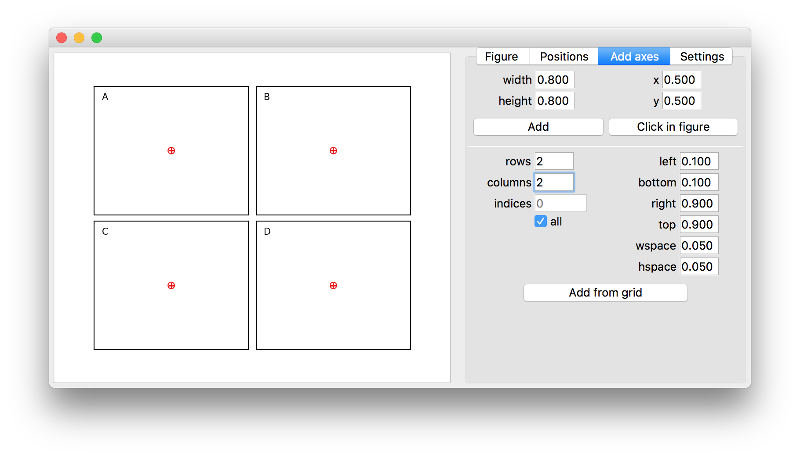

# Various utilities related to axes positioning
Correctly positioning axes in matplotlib can be a long and iterative process. 
Using the graphical interface utility `axpositioning.adjust_figure_layout(fig)` can ease the process.




## Features
1. Move and resize existing axes
2. Join, split and align axes
3. Change the used reference point of an axes bounds when editing
4. Create new axes by manually defining the position and size, clicking in the figure or using GridSpec settings
5. Change the size of the figure
6. Preview the updated positions of the empty placeholder axes during editing
7. Close to update the axes positions and size of the original figure

## Examples

Run from the command line

```bash
python -m axpositioning
```

Adjust figure layout using gui in script

```python
from matplotlib import pyplot as plt
import axpositioning

fig = plt.figure()
ax = fig.add_subplot(111)
ax.plot([0, 1], [0, 1])

axpositioning.adjust_figure_layout(fig)

plt.show()
```

Adjust axes position using anchors and plotutils.PositioningAxes

```python
from matplotlib import pyplot as plt
import axpositioning

fig = plt.figure()
ax = fig.add_axes([.1, .1, .8, .8])
p = axpositioning.PositioningAxes.from_axes(fig, ax, anchor='C')

p.set_anchor('C')
print(p.x, p.y)

p.set_anchor('SW')
print(p.x, p.y)

p.set_anchor('NE')
print(p.x, p.y)
```
